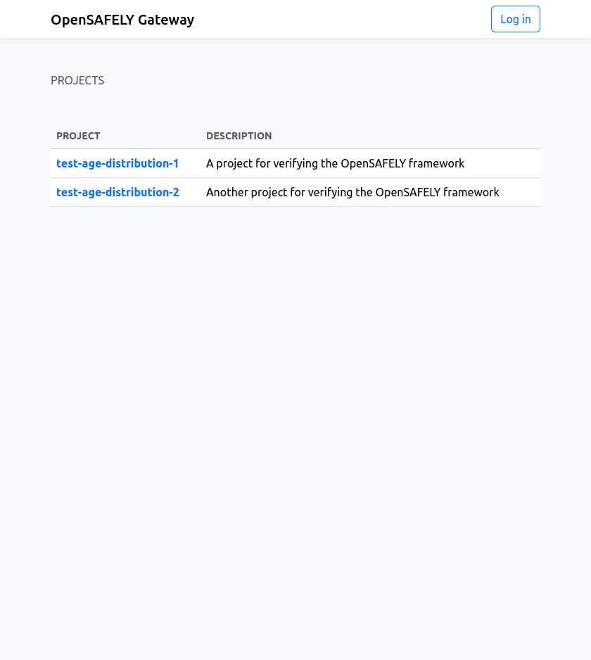
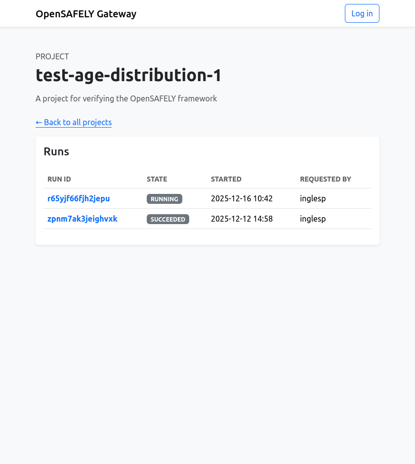
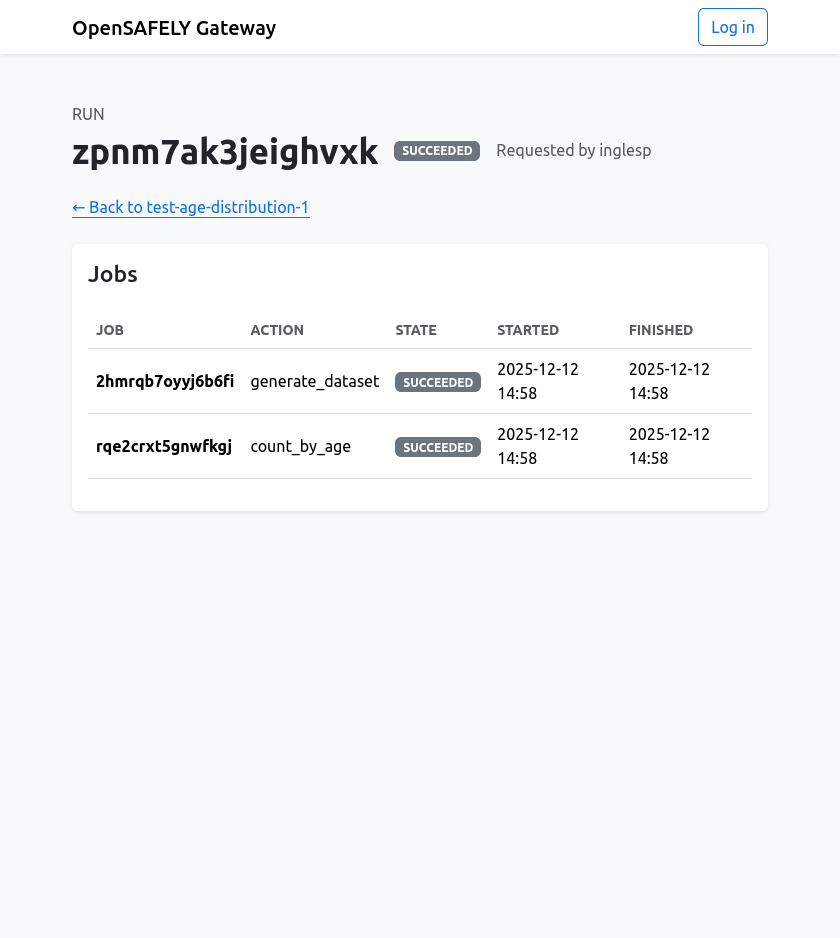

# OpenSAFELY Reference Gateway

This repository contains code for (part of) a reference implementation for an OpenSAFELY Gateway component.
It currently implements job management, but does not handle released outputs.

That is, it performs part of the role of [Job Server](https://github.com/opensafely-core/job-server/).
However, it is much simpler:

* We deal with a single backend.
* Each project can only have a single workspace or repo.
* All users are authorized to do anything.
* Users can only run the whole pipeline and not individual actions.

## Screenshots

## Developer docs

Please see the [additional information](DEVELOPERS.md).
